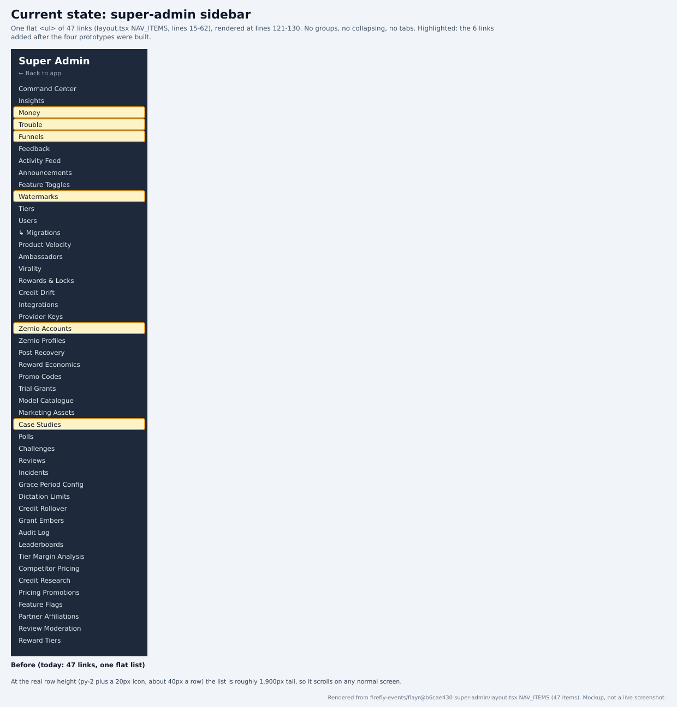
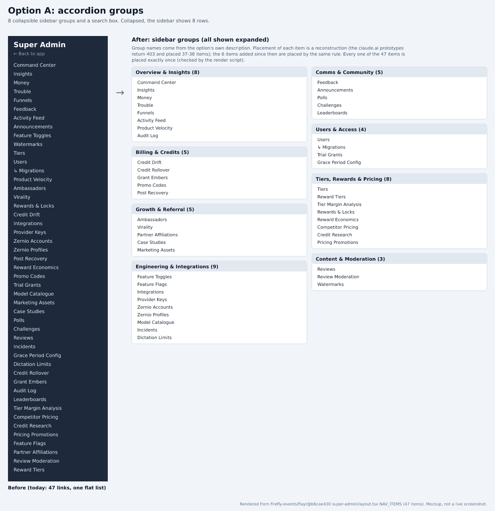
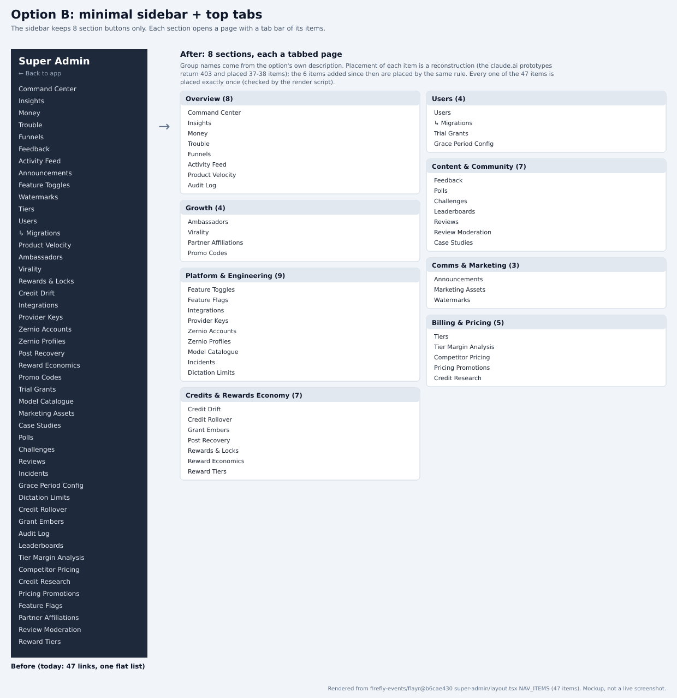
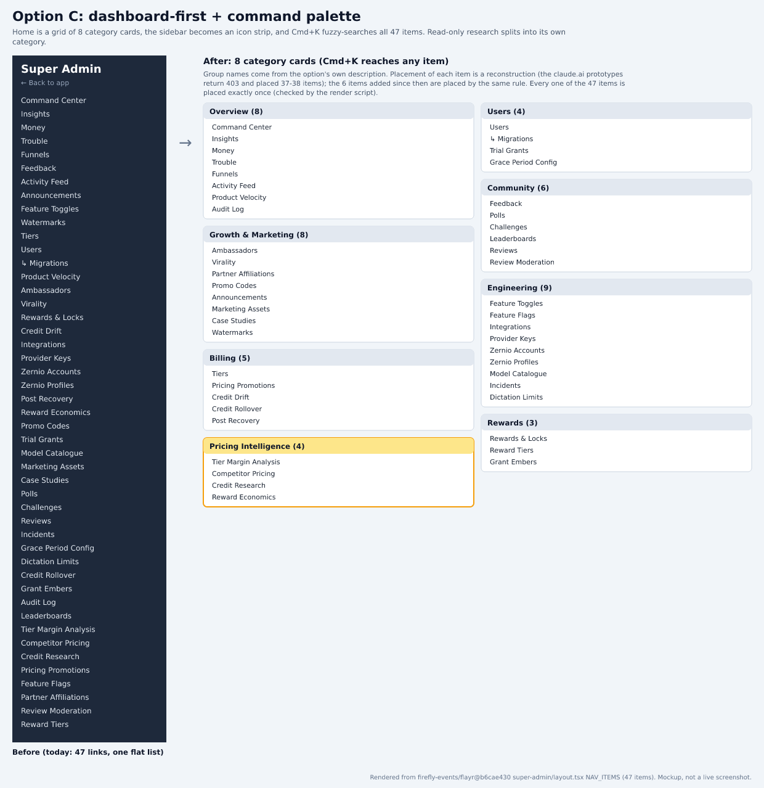
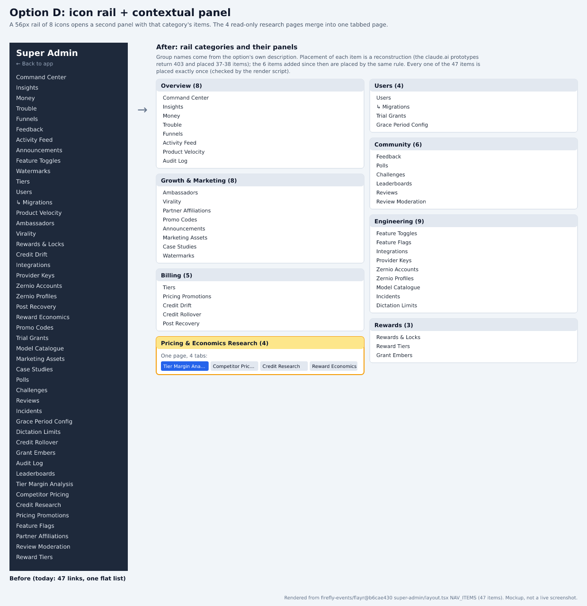

# Flayr super-admin nav: which overall structure?

Part of the PANT-941 survey rebuild. Source: `firefly-events/flayr` `development` @ `b6cae430`. Index and claims ledger: [README.md](README.md).

## Context
The super-admin sidebar is one flat list of 47 links (layout.tsx NAV_ITEMS), with no groups, collapsing or tabs, so it scrolls on any normal screen. Operator: "the left bar scrolls forever, many things can be joined together as tabs in a select few menu items, the dashboard needs to be cleaned." Four structures were prototyped earlier. Their claude.ai prototypes aren't reachable any more (403), and they placed 37-38 items, so the attached renders rebuild each structure against today's 47 items. Pick one, or mix elements; the result becomes the implementation spec for apps/dashboard. Questions 1-4 settle the details.

## Options
- **Option A: Accordion groups.** 8 collapsible sidebar groups (Overview & Insights, Comms & Community, Users & Access, Billing & Credits, Tiers/Rewards & Pricing, Growth & Referral, Content & Moderation, Engineering & Integrations) plus a search box over all 47 items. Collapsed, the sidebar is 8 rows. Every page keeps its own route.
- **Option B: Minimal sidebar + top tabs.** The sidebar keeps only 8 section buttons. Each section opens a page with a horizontal tab bar of its items (largest: Platform & Engineering with 9 tabs). Needs a tabbed shell per section.
- **Option C: Dashboard-first + command palette.** Home is a grid of 8 category cards; the sidebar becomes an icon strip; Cmd+K fuzzy-searches all 47 items. Read-only research pages split into their own category.
- **Option D: Icon rail + contextual panel.** A 56px rail of 8 category icons opens a second panel with that category's items. The four read-only research pages (Tier Margin Analysis, Competitor Pricing, Credit Research, Reward Economics) merge into one tabbed page.

## Research
### Current state: 47 flat links
NAV_ITEMS in super-admin/layout.tsx is one array of 47 { href, label, icon } entries, rendered as a single <ul>. 50 page.tsx files exist under super-admin/; the 3 not in the nav are case-studies/[slug], users/[clerkId] (detail routes) and flares-grant. The old survey text said 37 and 38 items, and PANT-919 counted 41 at 191db583.

Sources:
- https://github.com/firefly-events/flayr/blob/b6cae430b336fdc47a2a269214019df87620936a/apps/dashboard/src/app/super-admin/layout.tsx#L15-L63
- https://github.com/firefly-events/flayr/blob/b6cae430b336fdc47a2a269214019df87620936a/apps/dashboard/src/app/super-admin/layout.tsx#L121-L130

### What changed since the prototypes
Six links were added after the prototypes and after PANT-919: Money, Trouble, Funnels, Watermarks, Zernio Accounts and Case Studies. 'Dashboard' was renamed 'Command Center'. None of the four prototypes places these six; the renders place them by each option's own grouping rule.

Sources:
- https://github.com/firefly-events/flayr/blob/b6cae430b336fdc47a2a269214019df87620936a/apps/dashboard/src/app/super-admin/layout.tsx#L15-L63
- https://github.com/firefly-events/flayr/blob/b6cae430b336fdc47a2a269214019df87620936a/apps/dashboard/src/app/super-admin/money/page.tsx#L1-L8

### Cost of each structure in this codebase
Every entry is a plain Link in one array in one layout file. Option A changes only that file: a grouped array plus a collapsible list and search, with no new routes. Options B and D need a new tabbed shell page per section (and D's research merge needs one combined page). Option C needs a command palette and a new home grid. All four keep the existing page components.

Sources:
- https://github.com/firefly-events/flayr/blob/b6cae430b336fdc47a2a269214019df87620936a/apps/dashboard/src/app/super-admin/layout.tsx#L121-L130

### Recommendation: start from A
A fixes the reported problem (endless scrolling, no grouping) with the smallest change: one file, no route changes, and nothing for the other pages to absorb. B, C and D add value for power users but each needs new shells. Take A, and add Cmd+K search from C later if 8 groups still feel slow. The answers to questions 1-4 decide which pages share a group or a tabbed page.

Sources:
- https://github.com/firefly-events/flayr/blob/b6cae430b336fdc47a2a269214019df87620936a/apps/dashboard/src/app/super-admin/layout.tsx#L15-L63
- https://github.com/firefly-events/flayr/blob/b6cae430b336fdc47a2a269214019df87620936a/apps/dashboard/src/app/super-admin/layout.tsx#L121-L130

## Renders
Mockups built from the real NAV_ITEMS labels, not screenshots:

