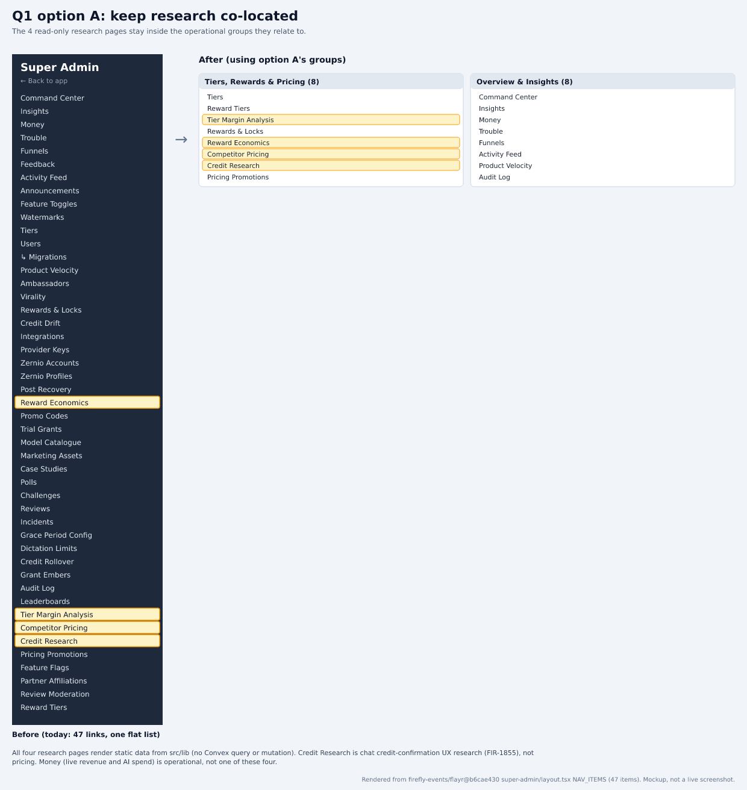
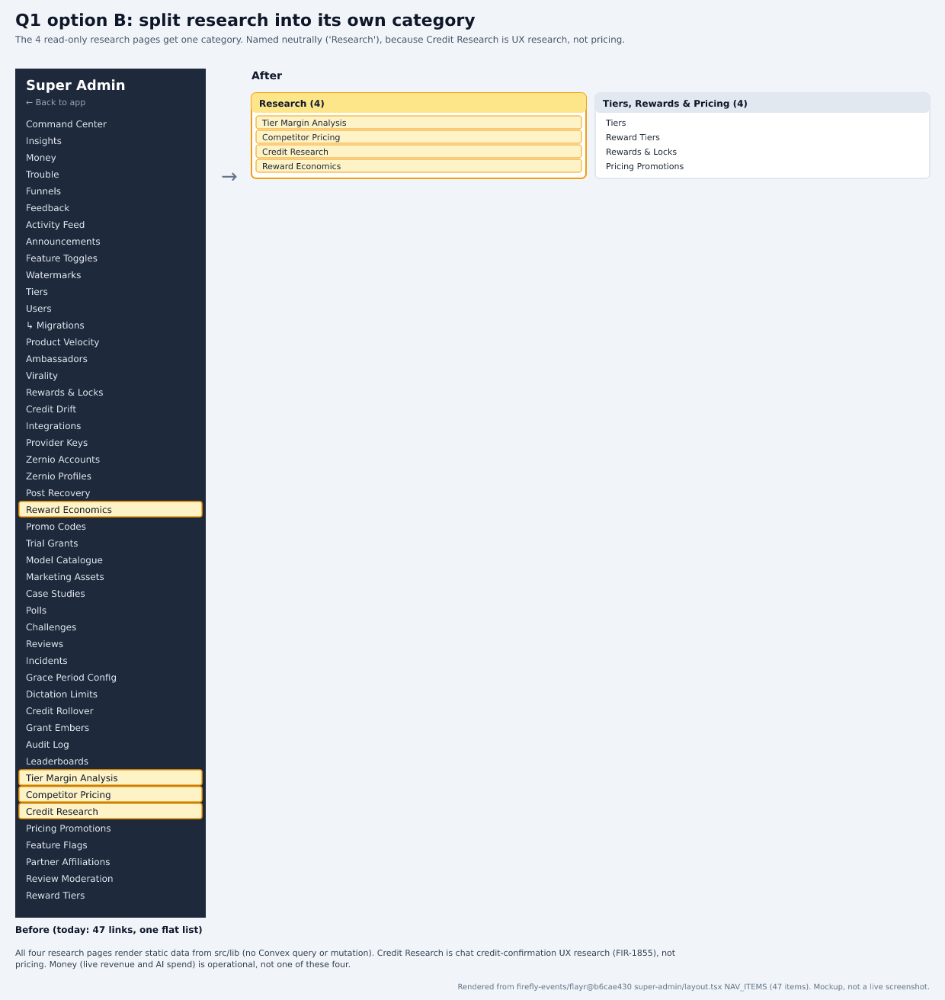

# Does read-only research get its own nav category?

Part of the PANT-941 survey rebuild. Source: `firefly-events/flayr` `development` @ `b6cae430`. Index and claims ledger: [README.md](README.md).

## Context
Four super-admin pages are static, read-only research references: Tier Margin Analysis, Competitor Pricing, Credit Research and Reward Economics. Prototypes A and B kept them next to related operational pages; C and D split them into their own category. The old text called that category 'Pricing Intelligence', but Credit Research is chat credit-confirmation UX research (FIR-1855), not pricing, so the split option here uses a neutral name.

## Options
| Option | Trade-offs |
|---|---|
| **A. Keep research co-located** | Fewer top-level groups, and each reference sits next to the page it informs (e.g. Tier Margin Analysis beside Tiers). The cost: static reference pages are mixed in with pages that change live data. |
| **B. Split into a 'Research' category** (recommended) | One more group, but a clean line between pages that act (Tiers, Reward Tiers, Pricing Promotions) and pages that only explain. 'Research' fits all four; 'Pricing Intelligence' doesn't fit Credit Research. |

## Research
### All four pages are static and read-only
Each renders constants from src/lib and none calls Convex (no useQuery, useMutation, fetchQuery or convex import). Tier Margin Analysis computes from TIER_COST_TABLE; Competitor Pricing reads a competitor catalogue; Credit Research reads credit-confirmation-options.ts; Reward Economics runs a fixed worst-case scenario.

Sources:
- https://github.com/firefly-events/flayr/blob/b6cae430b336fdc47a2a269214019df87620936a/apps/dashboard/src/app/super-admin/tier-margin-analysis/page.tsx#L1-L29
- https://github.com/firefly-events/flayr/blob/b6cae430b336fdc47a2a269214019df87620936a/apps/dashboard/src/app/super-admin/competitor-pricing-analysis/page.tsx#L1-L17
- https://github.com/firefly-events/flayr/blob/b6cae430b336fdc47a2a269214019df87620936a/apps/dashboard/src/app/super-admin/credit-confirmation-research/page.tsx#L1-L25
- https://github.com/firefly-events/flayr/blob/b6cae430b336fdc47a2a269214019df87620936a/apps/dashboard/src/app/super-admin/reward-economics/page.tsx#L1-L31

### They inform different decisions
Tier Margin Analysis and Competitor Pricing exist for the pricing committee (FIR-1517). Credit Research is UX research for the credit-confirmation implementation ticket (FIR-1857). Reward Economics sets a floor on loyalty reward values (FIR-1922). So 'Pricing Intelligence' mislabels at least one of them.

Sources:
- https://github.com/firefly-events/flayr/blob/b6cae430b336fdc47a2a269214019df87620936a/apps/dashboard/src/app/super-admin/tier-margin-analysis/page.tsx#L1-L11
- https://github.com/firefly-events/flayr/blob/b6cae430b336fdc47a2a269214019df87620936a/apps/dashboard/src/app/super-admin/competitor-pricing-analysis/page.tsx#L1-L9
- https://github.com/firefly-events/flayr/blob/b6cae430b336fdc47a2a269214019df87620936a/apps/dashboard/src/app/super-admin/credit-confirmation-research/page.tsx#L1-L14
- https://github.com/firefly-events/flayr/blob/b6cae430b336fdc47a2a269214019df87620936a/apps/dashboard/src/app/super-admin/reward-economics/page.tsx#L1-L8

### Money is not one of them
Money (added after the prototypes) shows live revenue, the AI spend ledger and Embers economics through superAdminQuery reads. It is operational, so it belongs with the overview pages, not in Research.

Sources:
- https://github.com/firefly-events/flayr/blob/b6cae430b336fdc47a2a269214019df87620936a/apps/dashboard/src/app/super-admin/money/page.tsx#L1-L8

### Recommendation: B
Because none of the four pages can change anything, grouping them apart from operational pages costs one group and makes 'can this page change live data?' obvious from the nav. Use the name 'Research'.

Sources:
- https://github.com/firefly-events/flayr/blob/b6cae430b336fdc47a2a269214019df87620936a/apps/dashboard/src/app/super-admin/layout.tsx#L15-L63

## Renders
Mockups built from the real NAV_ITEMS labels, not screenshots:

