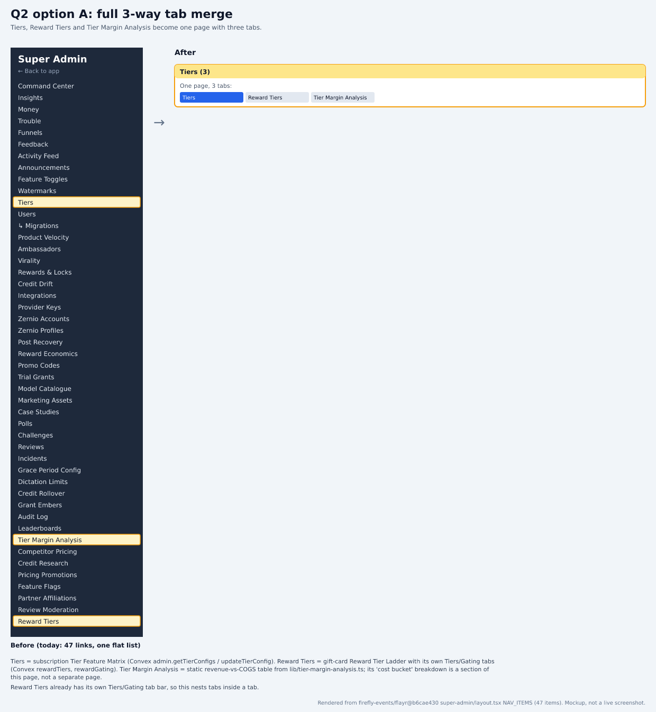
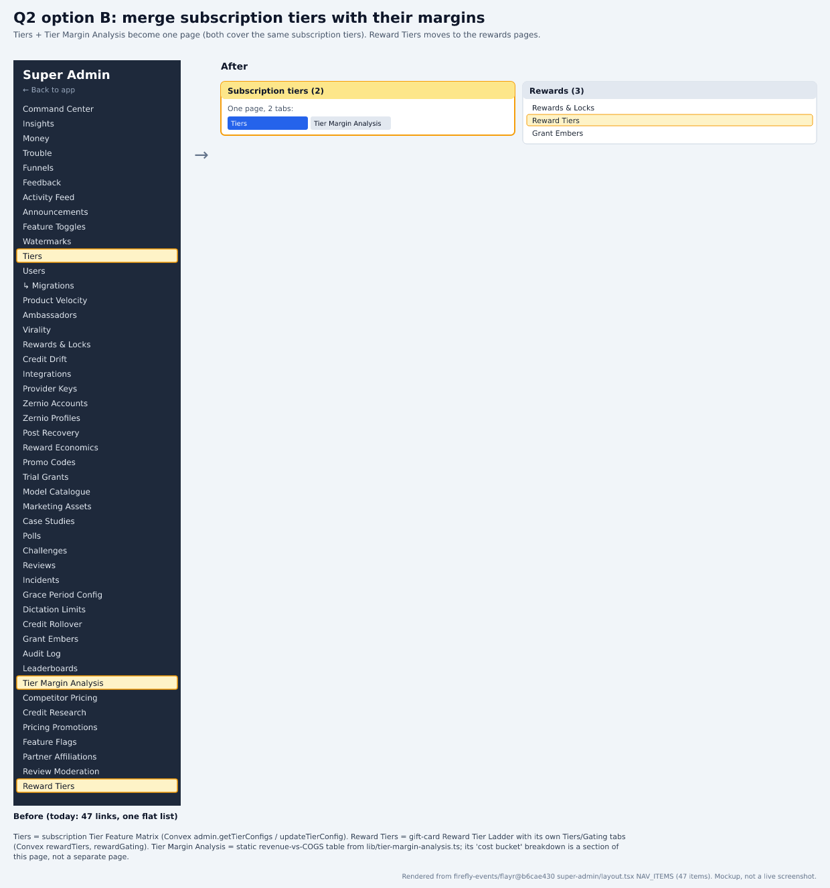
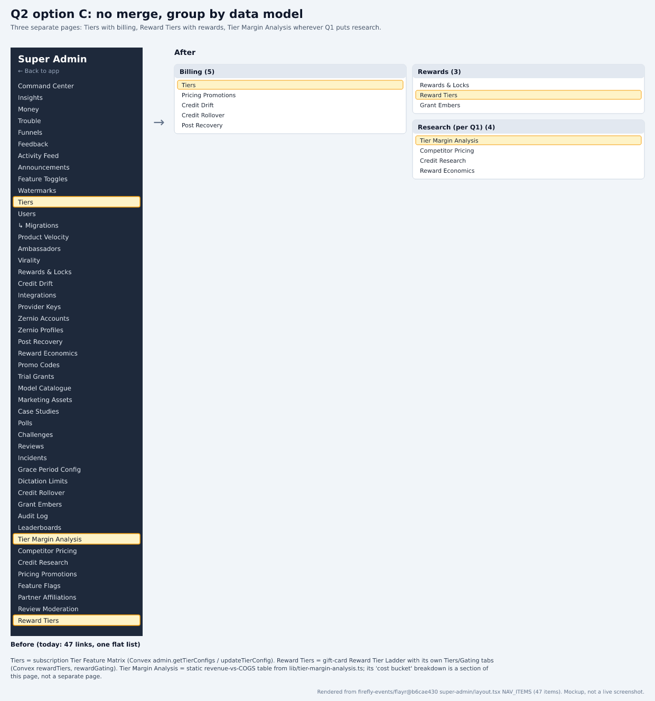

# Tiers, Reward Tiers and Tier Margin Analysis: merge or not?

Part of the PANT-941 survey rebuild. Source: `firefly-events/flayr` `development` @ `b6cae430`. Index and claims ledger: [README.md](README.md).

## Context
Three nav entries contain the word 'tier': Tiers (subscription Tier Feature Matrix), Reward Tiers (gift-card Reward Tier Ladder) and Tier Margin Analysis (static revenue-vs-COGS reference). The old question listed a 'Tier Cost Buckets' page; no such page exists, because the cost buckets are a section inside Tier Margin Analysis. So the real choice is between these three pages.

## Options
| Option | Trade-offs |
|---|---|
| **A. Merge all three into one tabbed page** | One nav entry, but three unrelated data sources in one component tree, and Reward Tiers already has its own Tiers/Gating tab bar, so tabs would nest. |
| **B. Merge Tiers + Tier Margin Analysis; move Reward Tiers to rewards** | Puts subscription tiers next to their margins, which would also expose drift between live prices (socialTierConfigs) and the hard-coded revenue in TIER_COST_TABLE. Conflicts with question 1's option B, which moves Tier Margin Analysis to Research. |
| **C. No merge; group by data model** (recommended) | Tiers joins billing, Reward Tiers joins the rewards pages, and Tier Margin Analysis goes wherever question 1 puts research. The smallest change, and no nested tabs, but no click saved between Tiers and its margins. |

## Research
### Tiers: subscription tier config
The 'Tier Feature Matrix' reads and edits Convex socialTierConfigs through admin.getTierConfigs / updateTierConfig (prices and features per subscription tier).

Sources:
- https://github.com/firefly-events/flayr/blob/b6cae430b336fdc47a2a269214019df87620936a/apps/dashboard/src/app/super-admin/tiers/page.tsx#L29-L32
- https://github.com/firefly-events/flayr/blob/b6cae430b336fdc47a2a269214019df87620936a/apps/dashboard/src/app/super-admin/tiers/page.tsx#L102
- https://github.com/firefly-events/flayr/blob/b6cae430b336fdc47a2a269214019df87620936a/apps/dashboard/convex/admin.ts#L55-L61

### Reward Tiers: gift-card reward ladder
The 'Reward Tier Ladder' configures gift-card reward tiers and eligibility gates (Convex rewardTiers, rewardGating); changes are live with no deploy. It already has a Tiers / Gating tab bar. It shares the word 'tier' with Tiers, not a data model.

Sources:
- https://github.com/firefly-events/flayr/blob/b6cae430b336fdc47a2a269214019df87620936a/apps/dashboard/src/app/super-admin/reward-tiers/page.tsx#L36-L42
- https://github.com/firefly-events/flayr/blob/b6cae430b336fdc47a2a269214019df87620936a/apps/dashboard/src/app/super-admin/reward-tiers/page.tsx#L59-L68

### Tier Margin Analysis, and where the 'cost buckets' are
A static page computed from TIER_COST_TABLE (no Convex). Its 'Cost breakdown per tier' section lists each tier's costBuckets; that section is what the old text called 'Tier Cost Buckets'. It carries its own monthlyRevenueUsd per subscription tier id, separate from the live prices in socialTierConfigs.

Sources:
- https://github.com/firefly-events/flayr/blob/b6cae430b336fdc47a2a269214019df87620936a/apps/dashboard/src/app/super-admin/tier-margin-analysis/page.tsx#L12-L29
- https://github.com/firefly-events/flayr/blob/b6cae430b336fdc47a2a269214019df87620936a/apps/dashboard/src/app/super-admin/tier-margin-analysis/page.tsx#L100-L102
- https://github.com/firefly-events/flayr/blob/b6cae430b336fdc47a2a269214019df87620936a/apps/dashboard/src/lib/tier-margin-analysis.ts#L90-L120
- https://github.com/firefly-events/flayr/blob/b6cae430b336fdc47a2a269214019df87620936a/apps/dashboard/src/lib/tier-margin-analysis.ts#L140-L147

### Recommendation: C
The three pages share a word, not data. Merging Reward Tiers with anything subscription-related joins unrelated models and nests tabs. C stays consistent with question 1 (Tier Margin Analysis is static research). If you want the price-drift check B would give, it's better as a small warning on Tiers than as a page merge.

Sources:
- https://github.com/firefly-events/flayr/blob/b6cae430b336fdc47a2a269214019df87620936a/apps/dashboard/src/app/super-admin/reward-tiers/page.tsx#L67-L68
- https://github.com/firefly-events/flayr/blob/b6cae430b336fdc47a2a269214019df87620936a/apps/dashboard/src/lib/tier-margin-analysis.ts#L140-L147

## Renders
Mockups built from the real NAV_ITEMS labels, not screenshots:

