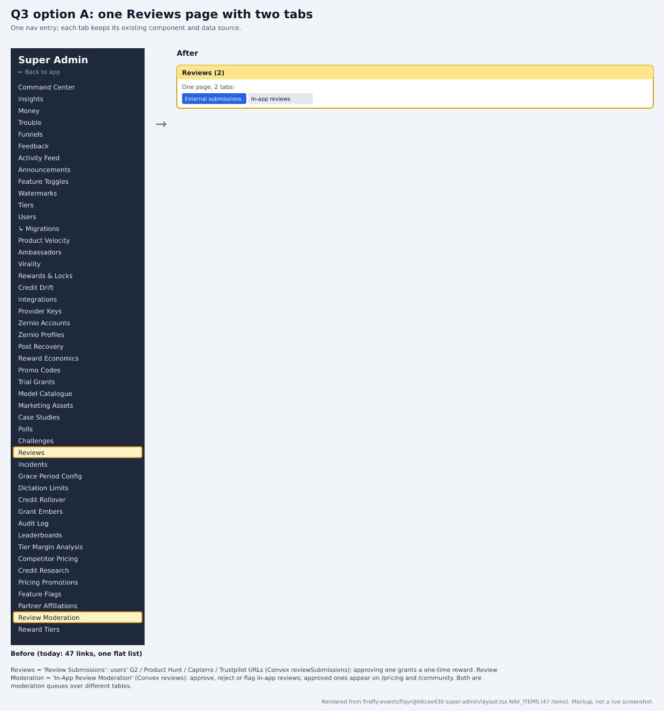
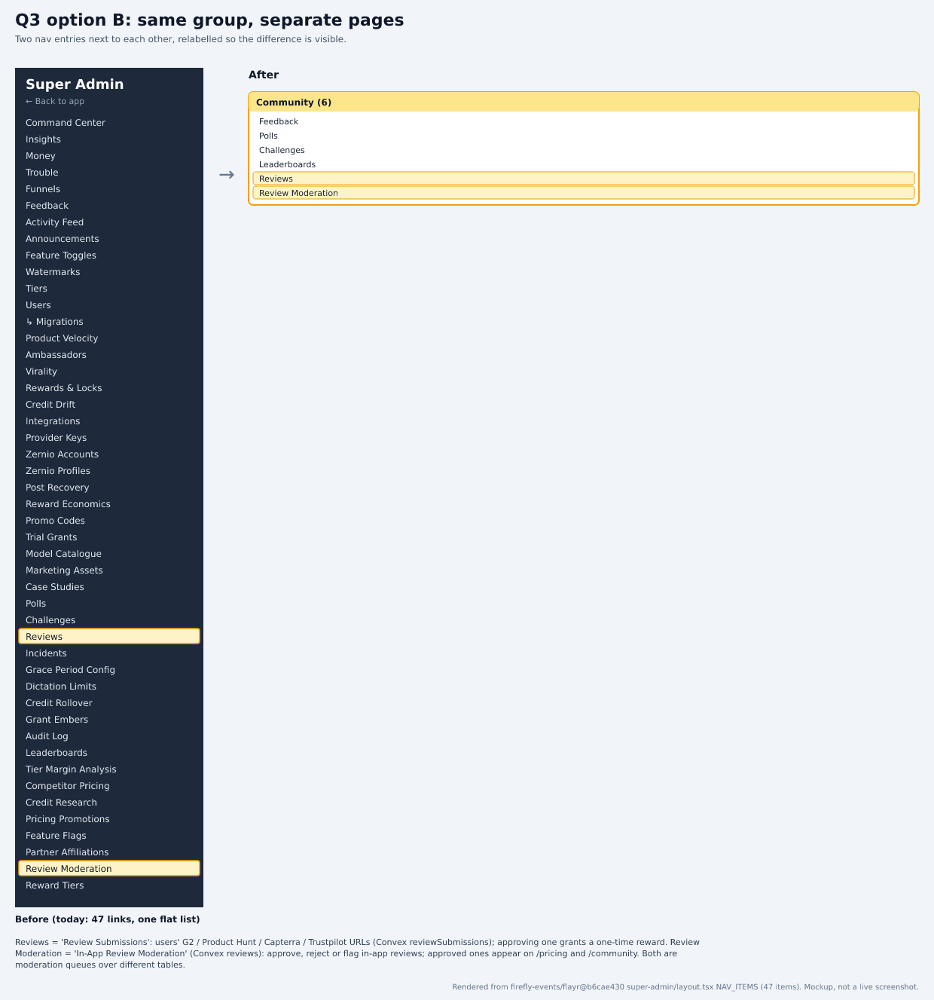

# Review Submissions and In-App Review Moderation: one page or two?

Part of the PANT-941 survey rebuild. Source: `firefly-events/flayr` `development` @ `b6cae430`. Index and claims ledger: [README.md](README.md).

## Context
The nav entry 'Reviews' is not a public review list. It's 'Review Submissions', the queue of users' G2 / Product Hunt / Capterra / Trustpilot review URLs, where approving one grants a one-time reward. 'Review Moderation' is 'In-App Review Moderation': approve, reject or flag reviews written inside Flayr, and approved ones appear on /pricing and /community. Both are moderation queues, over different tables.

## Options
| Option | Trade-offs |
|---|---|
| **A. One 'Reviews' page with two tabs** (recommended) | One nav entry for one job (clearing review queues). Each tab keeps its existing component and data source, so nothing is compromised. The cost: a tab shell to build. |
| **B. Same group, separate pages** | No new shell, just regrouping, but two entries for one job. Relabel them 'Review Submissions' and 'In-App Reviews' either way so the difference shows. |

## Research
### Reviews = external review submissions
The page is titled 'Review Submissions'. It lists submitted URLs by platform (G2, Product Hunt, Capterra, Trustpilot) and status (pending / approved / rejected) from Convex reviewSubmissions. Approving schedules a one-time reward of REVIEW_CREDIT_REWARD = 500 (the page text calls it 500 Embers).

Sources:
- https://github.com/firefly-events/flayr/blob/b6cae430b336fdc47a2a269214019df87620936a/apps/dashboard/src/app/super-admin/reviews/page.tsx#L11-L16
- https://github.com/firefly-events/flayr/blob/b6cae430b336fdc47a2a269214019df87620936a/apps/dashboard/src/app/super-admin/reviews/page.tsx#L102-L139
- https://github.com/firefly-events/flayr/blob/b6cae430b336fdc47a2a269214019df87620936a/apps/dashboard/convex/reviewSubmissions.ts#L1-L30
- https://github.com/firefly-events/flayr/blob/b6cae430b336fdc47a2a269214019df87620936a/apps/dashboard/convex/reviewSubmissions.ts#L127-L147

### Review Moderation = in-app reviews
Titled 'In-App Review Moderation', it moderates Convex reviews (FIR-2053) with approve / reject / flag. Approved public reviews appear on /pricing and /community through reviews.listPublic.

Sources:
- https://github.com/firefly-events/flayr/blob/b6cae430b336fdc47a2a269214019df87620936a/apps/dashboard/src/app/super-admin/review-moderation/page.tsx#L12-L16
- https://github.com/firefly-events/flayr/blob/b6cae430b336fdc47a2a269214019df87620936a/apps/dashboard/src/app/super-admin/review-moderation/page.tsx#L70-L76
- https://github.com/firefly-events/flayr/blob/b6cae430b336fdc47a2a269214019df87620936a/apps/dashboard/convex/reviews.ts#L1-L5
- https://github.com/firefly-events/flayr/blob/b6cae430b336fdc47a2a269214019df87620936a/apps/dashboard/convex/reviews.ts#L127
- https://github.com/firefly-events/flayr/blob/b6cae430b336fdc47a2a269214019df87620936a/apps/dashboard/convex/reviews.ts#L162-L189

### The old trade-off was based on a wrong premise
The old question weighed 'browsing' against 'moderating'. Neither page is for browsing: both are approve/reject queues for the same admin task, which removes the main argument for keeping them apart.

Sources:
- https://github.com/firefly-events/flayr/blob/b6cae430b336fdc47a2a269214019df87620936a/apps/dashboard/src/app/super-admin/reviews/page.tsx#L134-L139
- https://github.com/firefly-events/flayr/blob/b6cae430b336fdc47a2a269214019df87620936a/apps/dashboard/src/app/super-admin/review-moderation/page.tsx#L70-L76

### Recommendation: A
Same job, same person, different data: that's what tabs are for. The tab shell is thin because each tab renders an existing page component unchanged.

Sources:
- https://github.com/firefly-events/flayr/blob/b6cae430b336fdc47a2a269214019df87620936a/apps/dashboard/src/app/super-admin/reviews/page.tsx#L98-L104

## Renders
Mockups built from the real NAV_ITEMS labels, not screenshots:

