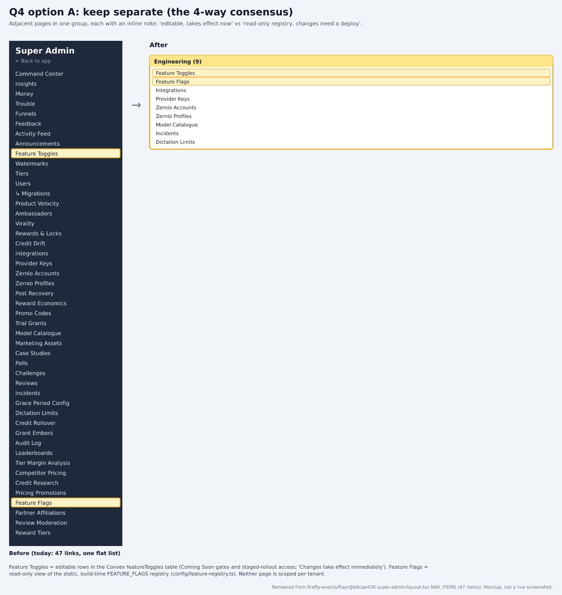
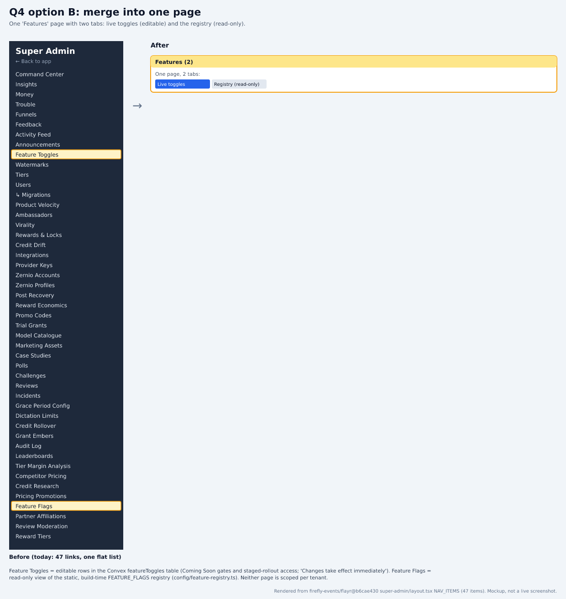

# Feature Toggles vs Feature Flags: confirm keeping them separate

Part of the PANT-941 survey rebuild. Source: `firefly-events/flayr` `development` @ `b6cae430`. Index and claims ledger: [README.md](README.md).

## Context
All four prototypes kept Feature Toggles and Feature Flags as separate pages with an inline note. This question records that consensus for you to confirm or override. The old text described toggles as per-tenant; the code has no tenant scoping. The real split: Toggles are editable Convex rows that take effect immediately, and Flags is a read-only view of the static FEATURE_FLAGS registry, which changes only with a deploy.

## Options
| Option | Trade-offs |
|---|---|
| **A. Keep separate (the consensus)** (recommended) | Adjacent pages in one group, each with an inline note: 'editable, takes effect now' vs 'read-only registry, changes need a deploy'. Keeps live controls off a read-only page. |
| **B. Merge into one 'Features' page with two tabs** | One nav entry, but editable controls and a read-only list share a page, and the different change paths (click vs deploy) are easier to miss. |

## Research
### Feature Toggles: live, editable
Manages Coming Soon gates and staged-rollout access in the Convex featureToggles table (getAll / upsert / seedDefaults). The page says 'Changes take effect immediately'. The table is global: nothing is keyed by tenant, org or workspace.

Sources:
- https://github.com/firefly-events/flayr/blob/b6cae430b336fdc47a2a269214019df87620936a/apps/dashboard/src/app/super-admin/feature-toggles/page.tsx#L166-L168
- https://github.com/firefly-events/flayr/blob/b6cae430b336fdc47a2a269214019df87620936a/apps/dashboard/src/app/super-admin/feature-toggles/page.tsx#L205-L206
- https://github.com/firefly-events/flayr/blob/b6cae430b336fdc47a2a269214019df87620936a/apps/dashboard/convex/featureToggles.ts#L1-L6

### Feature Flags: read-only registry
A server component (FIR-1768 phase 1) that lists FEATURE_FLAGS from config/feature-registry.ts, which is static build-time data. A PostHog toggle is planned for phase 2 but not built.

Sources:
- https://github.com/firefly-events/flayr/blob/b6cae430b336fdc47a2a269214019df87620936a/apps/dashboard/src/app/super-admin/feature-flags/page.tsx#L1-L11
- https://github.com/firefly-events/flayr/blob/b6cae430b336fdc47a2a269214019df87620936a/apps/dashboard/src/config/feature-registry.ts#L1-L24
- https://github.com/firefly-events/flayr/blob/b6cae430b336fdc47a2a269214019df87620936a/apps/dashboard/src/config/feature-registry.ts#L81

### Recommendation: A
The two pages differ in storage (Convex rows vs a source file) and in how they change (instantly vs a deploy). Keeping them apart, side by side with a note on each, matches the code and the four-way consensus. Revisit if flags phase 2 makes the registry editable.

Sources:
- https://github.com/firefly-events/flayr/blob/b6cae430b336fdc47a2a269214019df87620936a/apps/dashboard/src/app/super-admin/feature-flags/page.tsx#L1-L9
- https://github.com/firefly-events/flayr/blob/b6cae430b336fdc47a2a269214019df87620936a/apps/dashboard/convex/featureToggles.ts#L1-L6

## Renders
Mockups built from the real NAV_ITEMS labels, not screenshots:

