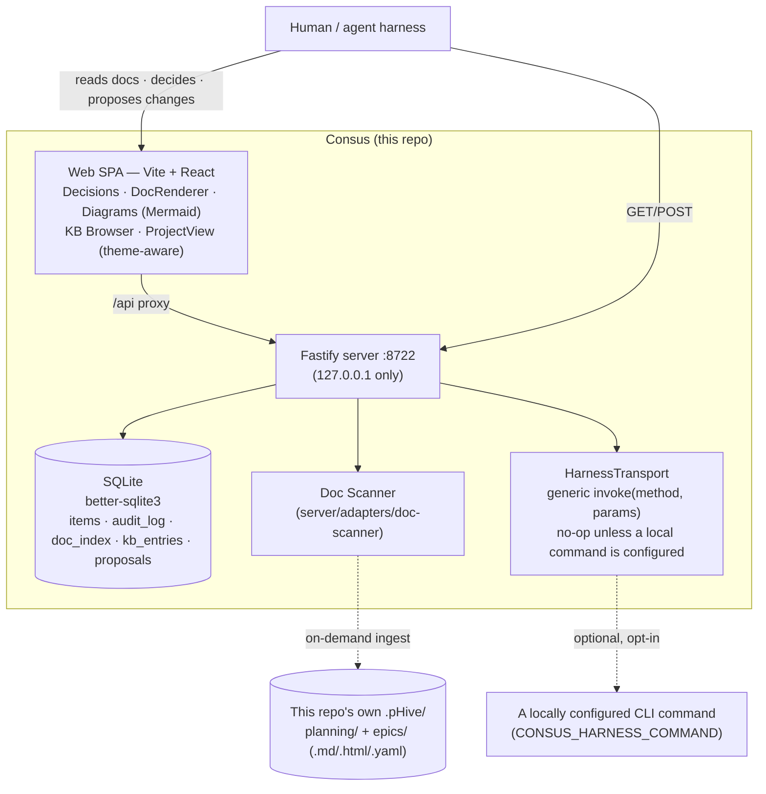

# Consus

**A standalone architect tool for any repo** — a local knowledgebase, graph, and doc editor for a repo's own decisions, docs, and architecture, with an agent-facing HTTP API so any Claude-Code-compatible harness can read and write to it.

## What & why

A repo accumulates decisions, briefs, PRDs, architecture docs, plans, CBAs, and epic/story plans as `.md`/`.html`/YAML files on disk. **Reading those cleanly from a shell session, or tracking which decisions are still open, is tedious.** Consus indexes a repo's own `.pHive/` tree and gives it a real surface: browse the docs, see the diagram cascade, read and answer the open decision queue, edit a doc and propose the change back.

The core loop: **index → open → interact → propose a change → shared-truth KB.**

1. **Index** — an operator-triggered, on-demand scan (`POST /api/projects/:project/ingest`) walks a repo's `.pHive/planning/` and `.pHive/epics/**` and populates the doc index. Deliberately not a background poll.
2. **Open** — the per-project view shows a project's diagram cascade, its docs, and its KB entries together.
3. **Interact** — read a rendered doc or a Mermaid diagram cascade, edit a doc section in place.
4. **Propose a change** — `POST /api/proposals` fires a `{diff, description}` at whatever local harness is configured (`HarnessTransport`); the harness applies it and reports back.
5. **Shared-truth KB** — an approved decision or doc becomes a durable, versioned `kb_entries` row, grouped by collection (`marketing` / `boundary-decisions` / `plans` / `artifacts` / `general`).

Consus is fully standalone: **zero live coupling to any other system.** It reads and writes only local SQLite and the local filesystem. It binds to `127.0.0.1` only — no network exposure.

## Architecture



Internally: a **Fastify** HTTP server (`server/index.ts`) bound to `127.0.0.1:8722`, an idempotent **SQLite** schema (`server/db/migrate.ts`), a **doc scanner** (`server/adapters/doc-scanner` — the only adapter in the codebase) that indexes a repo's own generated docs, a `dostal:decision-request/v1` contract parser, a **KB store** with append-only audit log, draft/publish separation, and versioning, and the generic **`HarnessTransport`** seam (`server/harness/transport.ts`) for the propose-a-change mechanism — it defaults to a no-op and has no knowledge of what, if anything, is configured on the other end. The web layer is a Vite + React SPA (`web/src/App.tsx`) whose feature components render docs via `marked`, diagrams via Mermaid, and present theme-aware decision cards.

## How it fits

Consus is a standalone tool today — it does not reach out to any other system's API or client library (see `package.json`'s dependency list). Any agent harness that understands `skills/consus/SKILL.md` can drive it over plain HTTP: read the decision queue, push a decision or CBA, propose a doc/diagram change. Cross-system integration (e.g. a future Pantheon L2 adapter layer) is explicitly out of Consus's own codebase — if it ever exists, it talks to Consus over these same generic HTTP routes, the same as any other harness would.

## Quickstart

```bash
npm install

# dev — web + server together (web proxies /api → :8722)
npm run dev

# or run them separately
npm run dev:server   # Fastify on :8722 (tsx watch)
npm run dev:web      # Vite dev server, proxies /api to :8722

# tests (Vitest — TDD backend / BDD UI)
npm test

# production build + start
npm run build        # → dist-web/ + dist-server/
npm start            # node dist-server/index.js on :8722  (or scripts/start.sh)
```

Config via env: `PORT` (default `8722`), `CONSUS_DB_PATH` (default `.pHive/consus.sqlite`), `CONSUS_PROJECTS_CONFIG` (repos to scan for docs, default `.pHive/consus-projects.json`).

Verify it's up:

```bash
curl localhost:8722/health          # { "status": "ok", "sqlite": "connected" }
curl localhost:8722/api/decisions   # open, undecided decision-request items
```

The full HTTP contract lives in [`docs/api-reference.md`](docs/api-reference.md) — a harness author can use Consus from that doc alone.

## Status

**v0.6.0.** The server, HTTP API, SQLite store, on-demand doc scanner, decision contract, KB store (with draft/submit separation and versioning), the generic proposal/harness mechanism, and the Mermaid-rendered diagram cascade are **live and tested**. The SPA shell (`web/src/App.tsx`) is assembled and wired: a per-project view shows a project's diagrams, docs, and KB entries together, with an in-place doc editor and a "Fire to harness" propose-a-change action.

Consus went through a real architectural correction along the way: it briefly grew live integrations with several other systems, and that coupling was fully stripped back out (see `CHANGELOG.md`'s `[0.6.0]` entry) — the codebase today has no adapter for, client for, or dependency on any external system beyond what's listed in `package.json`. See [VISION.md](VISION.md) for the current state and where things go next.

<!-- shared:support -->
## Support this project

Free and open source, always. A few ways to help — or just say hi:

- **Use it, star it, file an issue.** Honestly the best support an open-source project can get. → [this project](https://github.com/mdostal/consus)
- **Hire me.** I do fractional-CTO and consulting work — fixing and scaling tech stacks. → [mdostal.com/contact](https://mdostal.com/contact)
- **[Buy me a coffee](https://www.buymeacoffee.com/mdostal)** if it saved you time.
- **More tools like this** → [tools.mdostal.com](https://tools.mdostal.com)
- **Life outside the terminal** → [life.mdostal.com](https://life.mdostal.com)
- **What we're building at Firefly Events** — event discovery, 8,000+ events/day from 7+ sources → [ff.events](https://ff.events)

Always up for a conversation if any of it's useful to you.
<!-- /shared:support -->
