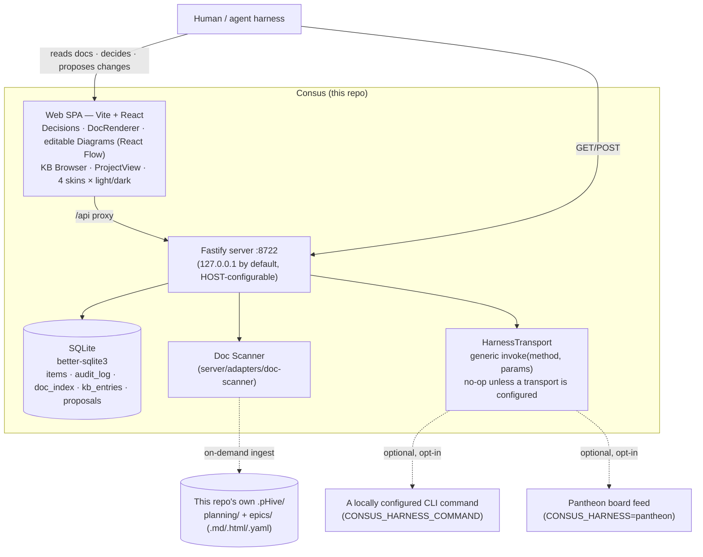

# Consus

**A standalone architect tool for any repo** — a local knowledgebase, graph, and doc editor for a repo's own decisions, docs, and architecture, with an agent-facing HTTP API so any Claude-Code-compatible harness can read and write to it.

## What & why

A repo accumulates decisions, briefs, PRDs, architecture docs, plans, CBAs, and epic/story plans as `.md`/`.html`/YAML files on disk. **Reading those cleanly from a shell session, or tracking which decisions are still open, is tedious.** Consus indexes a repo's own `.pHive/` tree and gives it a real surface: browse the docs, edit and rewire the diagram cascade directly, read and answer the open decision queue, edit a doc and propose the change back.

The core loop: **index → open → interact → propose a change → shared-truth KB.**

1. **Index** — an operator-triggered, on-demand scan (`POST /api/projects/:project/ingest`, or `POST /api/projects/scan-all` across every configured repo) walks a repo's `.pHive/planning/` and `.pHive/epics/**` and populates the doc index. Deliberately not a background poll.
2. **Open** — the per-project view shows a project's diagram cascade, its architecture diagram, its docs, and its KB entries together.
3. **Interact** — read a rendered doc or edit a section in place; drag, relabel, connect, and delete nodes directly on either diagram (a real editable canvas, not a static render) with a live changeset of what's pending.
4. **Propose a change** — one "Fire to harness" action (from a doc edit or a diagram edit) sends a `{diff, description}` through whatever local harness is configured (`HarnessTransport`); the harness applies it and reports back.
5. **Shared-truth KB** — an approved decision or doc becomes a durable, versioned `kb_entries` row, grouped by collection (`marketing` / `boundary-decisions` / `plans` / `artifacts` / `general`).

Pick a visual skin (Granary — the default — Drafting Table, Case Board, or Harness) and a light/dark/system theme from the masthead — four genuinely different looks over the same interactions, not just a recolor. A `⌘K` command palette covers the keyboard-shortcut floor for everything above.

Consus is standalone by default: out of the box it reads and writes only local SQLite and the local filesystem, and makes no outbound network calls. The one optional exception is the Pantheon integration (`CONSUS_HARNESS=pantheon` / `PANTHEON_API_URL`, see **Harness transports** below), which you have to turn on explicitly. It binds to `127.0.0.1` by default — no network exposure unless you explicitly opt in via `HOST` (e.g. for a containerized deploy).

## Brand

See [`branding/`](./branding/) for Consus's brand guide — colors, typography, and the
approved logo direction (Monogram). That folder is the finalized, human-facing copy;
`.pHive/brand/` holds the same files as the live source Consus itself scans to power the
in-app brand decision.

## Architecture


```mermaid
flowchart TB
  subgraph Consus["Consus (this repo)"]
    direction TB
    Web["Web SPA — Vite + React<br/>Decisions · DocRenderer · editable Diagrams (React Flow)<br/>KB Browser · ProjectView · 4 skins × light/dark"]
    API["Fastify server :8722<br/>(127.0.0.1 by default, HOST-configurable)"]
    DB[("SQLite<br/>better-sqlite3<br/>items · audit_log · doc_index · kb_entries · proposals")]
    Scanner["Doc Scanner<br/>(server/adapters/doc-scanner)"]
    Harness["HarnessTransport<br/>generic invoke(method, params)<br/>no-op unless a transport is configured"]
    Web -->|/api proxy| API
    API --> DB
    API --> Scanner
    API --> Harness
  end

  Scanner -.on-demand ingest.-> Repo[("This repo's own .pHive/<br/>planning/ + epics/ (.md/.html/.yaml)")]
  Harness -.optional, opt-in.-> LocalCmd["A locally configured CLI command<br/>(CONSUS_HARNESS_COMMAND)"]
  Harness -.optional, opt-in.-> PantheonFeed["Pantheon board feed<br/>(CONSUS_HARNESS=pantheon)"]

  Human["Human / agent harness"] -->|reads docs · decides · proposes changes| Web
  Human -->|GET/POST| API
```

Internally: a **Fastify** HTTP server (`server/index.ts`) bound to `127.0.0.1:8722` by default, serving both the JSON API and the built web SPA (`dist-web/`, via `@fastify/static`); an idempotent **SQLite** schema (`server/db/migrate.ts`); a **doc scanner** (`server/adapters/doc-scanner`) that indexes a repo's own generated docs, plus a **gitdocs** adapter (`server/adapters/gitdocs`) that resolves doc references across repos and reads docs at a git ref; a `dostal:decision-request/v1` contract parser; a **KB store** with append-only audit log, draft/publish separation, and versioning; the generic **`HarnessTransport`** seam (`server/harness/transport.ts`) for the propose-a-change mechanism, which defaults to a no-op; and the opt-in Pantheon integration (`server/harness/pantheon-result-puller.ts`, `server/pantheon/`), which is inert unless `CONSUS_HARNESS=pantheon` / `PANTHEON_API_URL` is set. The web layer is a Vite + React SPA (`web/src/App.tsx`) whose feature components render docs via `marked`, diagrams via an editable **React Flow** canvas, and present theme-aware decision cards across four switchable visual skins.

## Connect an agent harness

```bash
npm run agent:init     # installs skills/consus/SKILL.md into ~/.claude/skills/consus/
npm run agent:status   # read-only — check whether it's installed and current
```

One command gets a Claude Code session on this machine reading and acting on this repo's decision
queue, regardless of which repo that session is running from — idempotent, safe to re-run any
time. The running app itself surfaces this same command in a banner at the top of every tab. v1
targets Claude Code only; see [`skills/consus/SKILL.md`](skills/consus/SKILL.md) for the full
agent-facing contract.

**Standalone (no Pantheon) — file transport:** Set `CONSUS_HARNESS_FILE_DIR=.pHive/handoffs` when
starting Consus. Proposals are written as JSON files; a harness reads and acts on them via
`node bin/handoff.mjs` (or `npm run handoff`). No live integration required.

## How it fits

Consus is a standalone tool — any harness that understands `skills/consus/SKILL.md` can drive it over plain HTTP. By default it keeps proposals local (`NOOP_HARNESS_TRANSPORT`); set `CONSUS_HARNESS=pantheon` to forward proposals to a Pantheon board feed, with results and question tickets pushed back in (or pulled, with `CONSUS_PANTHEON_POLL=1`). Proposals always go through the `HarnessTransport` seam (`server/harness/transport.ts`). The Pantheon mode adds two more touchpoints: pushed (or, opt-in, polled) Pantheon question tickets become surveys, and a verdict bridge posts answers back.

## Quickstart

```bash
npm install

# dev — web + server together (web proxies /api → :8722)
npm run dev

# or run them separately
npm run dev:server   # Fastify on :8722 (tsx watch)
npm run dev:web      # Vite dev server, proxies /api to :8722

# tests (Vitest — TDD backend / BDD UI)
npm test

# production build + start
npm run build        # → dist-web/ + dist-server/
npm start            # node dist-server/index.js on :8722  (or scripts/start.sh)
```

Config via env: `PORT` (default `8722`), `HOST` (default `127.0.0.1` — set `0.0.0.0` for a containerized deploy, since `127.0.0.1` inside a container is unreachable from outside it), `CONSUS_DB_PATH` (default `.pHive/consus.sqlite`), `CONSUS_PROJECTS_CONFIG` (repos to scan for docs, default `.pHive/consus-projects.json`). Harness: `CONSUS_HARNESS=pantheon` + `PANTHEON_API_URL=<url>` enables the Pantheon board-feed transport — Pantheon then pushes question tickets in (`POST /api/questions/import`, `POST /api/questions/:ticket/close`) and Consus creates one survey per question ticket, with one decision item per question mapped to the appropriate answer shape. Polling is off by default; `CONSUS_PANTHEON_POLL=1` also starts the **Pantheon question adapter** (s6), which polls `GET /api/feed/questions?status=pending&surface=decision` every 60 seconds, and the result puller. When the operator answers a question-linked item, Consus posts a partial answer back to Pantheon (`POST /api/feed/questions/:ticket/partial`); once every question in the ticket is answered, it posts a final submit (`POST /api/feed/questions/:ticket/submit`). Question-linked items do **not** go through the `/api/events/decisions` seed path — that path is for unlinked decisions only. `PANTHEON_API_URL` without `CONSUS_HARNESS=pantheon` still posts decided verdicts to `/api/events/decisions`, but starts no pollers. `CONSUS_HARNESS_COMMAND=<cmd>` (optional `CONSUS_HARNESS_ARGS`) enables a custom stdio transport. Every env var is listed in [`docs/configuration.md`](docs/configuration.md); see also `.env.example`.

**Harness transports** (opt-in, mutually exclusive — only one is active at a time):

Selected at startup by `selectHarnessTransport` (`server/index.ts`); the first match in this order wins.

| Env var | Transport | Notes |
|---|---|---|
| `CONSUS_HARNESS=pantheon` + `PANTHEON_API_URL` | Pantheon | POSTs each proposal to `{PANTHEON_API_URL}/api/feed/changes`; results come back through `POST /api/proposals/:id/result`. With `CONSUS_PANTHEON_POLL=1` it also starts two 60-second pollers: the result puller (applies Pantheon's results back to proposals) and the question adapter (above). Startup fails if `PANTHEON_API_URL` is missing. |
| `CONSUS_HARNESS_FILE_DIR` | File (standalone) | Writes each proposal as a JSON file under the given dir (default suggestion: `.pHive/handoffs`). A harness reads those files via `consus handoff` (see below). |
| `CONSUS_HARNESS_COMMAND` | Stdio | Spawns the configured command and speaks one JSON object per line over stdin/stdout. `CONSUS_HARNESS_ARGS` (comma-separated) passes additional arguments. |
| _(none set)_ | NOOP | Proposals are recorded as `failed` immediately — the default for a fresh install. |

**`consus handoff` — standalone harness interface for the file transport:**

```bash
# List pending handoffs (with diffs)
node bin/handoff.mjs list
# or: npm run handoff list

# Report a result back to Consus (removes the handoff file on success)
node bin/handoff.mjs result <proposalId> applied
node bin/handoff.mjs result <proposalId> failed "reason text"
```

`CONSUS_HANDOFF_DIR` overrides the directory (default: `.pHive/handoffs`). `CONSUS_URL` overrides the Consus server URL (default: `http://localhost:${PORT}`).

Verify it's up:

```bash
curl localhost:8722/health          # { "status": "ok", "sqlite": "connected" }
curl localhost:8722/api/decisions   # open, undecided decision-request items
```

The full HTTP contract lives in [`docs/api-reference.md`](docs/api-reference.md) — a harness author can use Consus from that doc alone.

## Desktop app

Consus also ships as a native macOS app (Tauri) — a menu-bar-resident window around the same server, with its own app-local SQLite/config under `~/Library/Application Support/com.mdostal.consus/` (fully separate from any `.pHive/consus.sqlite` used by the CLI/dev flow, so the app always starts with an empty project list on first run).

```bash
cd app/src-tauri
cargo tauri build     # release build; stages a self-contained copy of
                       # dist-server/ + dist-web/ via build-resources.sh,
                       # then bundles it into the .app — no dependency on
                       # this checkout's own path once installed
```

The built app lands at `app/src-tauri/target/release/bundle/macos/Consus.app` — copy it to `/Applications/` to install. It runs the sidecar (`node dist-server/index.js`) as a plain OS process against a freshly picked free port, health-checks `GET /health` before showing the window, and lives in the menu bar tray (single-instance, close-to-tray, optional launch-at-login).

For iterative development, `cargo tauri dev` / `cargo tauri build --debug` fall back to this checkout's own `npm run build` output instead of a staged bundle.

## Status

**v0.17.2.** The server (serving its own built dashboard, not just the JSON API), SQLite store, on-demand doc scanner + multi-repo scan-all, decision contract + classifier, KB store (draft/submit separation and versioning), the generic proposal/harness mechanism, an editable diagram canvas (React Flow) for both the epic/story cascade and the architecture diagram, a real light/dark/system theme control, three switchable visual skins, a `⌘K` command palette, and agent-harness support for both Claude Code and Codex CLI (`npm run agent:init`) were all live as of v0.11.0. Since then: eight decision/survey answer shapes total (feature-selection, edit-proposal, CBA, free-text, rating, ranking, concept-selection, on top of the original decision-request), file attachments with inline image previews, branch-level decision/doc surfacing (git-local, no GitHub API), a native macOS desktop shell (`Consus.app`, Tauri v2, see **Desktop app** below), feature-grouped + overview + design-wireframe doc browsing with propose/approve/deny actions, rendered visual diffs (shared component across doc and diagram proposals), design/brand artifacts (`.pHive/brand/`) synthesizing into a real, in-app decidable decision, and — closing that loop all the way — the decided brand is now a real 4th skin ("Granary"), the default for fresh installs, with a real brand mark and app icon replacing the placeholders. See `CHANGELOG.md` for the full release history and [`branding/`](./branding/) for the brand guide that made it in.

Consus went through a real architectural correction along the way: it briefly grew live integrations with several other systems, and that coupling was fully stripped back out (see `CHANGELOG.md`'s `[0.6.0]` entry). The one external client that exists today is the opt-in Pantheon integration described under **Harness transports**; with it off, Consus depends on nothing beyond what's listed in `package.json`. See [VISION.md](VISION.md) for the current state and where things go next.

<!-- shared:support -->
## Support this project

Free and open source, always. A few ways to help — or just say hi:

- **Use it, star it, file an issue.** Honestly the best support an open-source project can get. → [this project](https://github.com/mdostal/consus)
- **Hire me.** I do fractional-CTO and consulting work — fixing and scaling tech stacks. → [mdostal.com/contact](https://mdostal.com/contact)
- **[Buy me a coffee](https://www.buymeacoffee.com/mdostal)** if it saved you time.
- **More tools like this** → [tools.mdostal.com](https://tools.mdostal.com)
- **Life outside the terminal** → [life.mdostal.com](https://life.mdostal.com)
- **What we're building at Firefly Events** — event discovery, 8,000+ events/day from 7+ sources → [ff.events](https://ff.events)

Always up for a conversation if any of it's useful to you.
<!-- /shared:support -->
