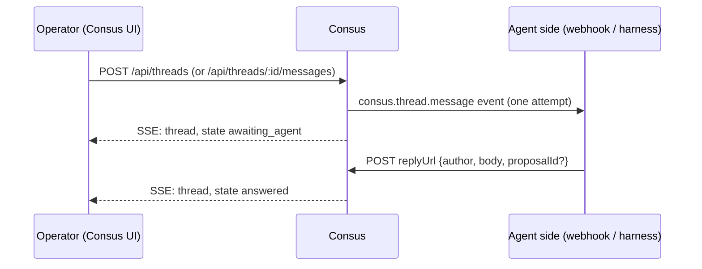

# Agent Threads

An operator comments on a doc, a section or line range of a doc, a diagram, a decision or a proposal. Consus sends that message out as one generic event. An agent answers in the same thread, and can link a change proposal it opened. The UI shows the reply as soon as it arrives.

Consus has no knowledge of who answers. This page is the contract the other side implements (for Pantheon, the `d5-pantheon-thread-adapter`). Consus never edits a repo itself: an agent that wants to change something opens a proposal through the normal path and links it in its reply.

---

## Flow



---

## Outbound: the `consus.thread.message` event

Sent once for every operator message, to:

1. `CONSUS_THREAD_WEBHOOK_URL`, as the JSON request body of a `POST`. Any 2xx counts as delivered, and the response body is ignored. Timeout is 10 seconds.
2. Otherwise the configured harness transport, as `invoke("threadMessage", <event>)`:
    - **file** (`CONSUS_HARNESS_FILE_DIR`): written to `<dir>/threads/<threadId>.<messageId>.json`
    - **stdio** (`CONSUS_HARNESS_COMMAND`): `{"method":"threadMessage","params":<event>}` on stdin. The harness answers on stdout with a `HarnessResult` (`{"ok":true,"result":null}`).
    - **webhook** (`CONSUS_HARNESS=webhook`): `{"method":"threadMessage","params":<event>}` POSTed to `CONSUS_HARNESS_WEBHOOK_URL`
    - **pantheon** and **none**: not delivered. The message is marked failed with the reason.

```json
{
  "type": "consus.thread.message",
  "version": 1,
  "threadId": "2f1c…",
  "item": { "type": "doc", "id": "doc:consus:docs/index.md" },
  "anchor": { "section": "Getting started", "line": 4, "lineEnd": 9 },
  "message": {
    "id": 17,
    "role": "operator",
    "author": "Mathew",
    "body": "Can you tighten this section?",
    "createdAt": "2026-10-10T21:40:00.000Z"
  },
  "context": [
    { "id": 15, "role": "operator", "author": "Mathew", "body": "…", "proposalId": null, "createdAt": "…" },
    { "id": 16, "role": "agent", "author": "pantheon:auriga", "body": "…", "proposalId": "p-1", "createdAt": "…" }
  ],
  "replyUrl": "http://127.0.0.1:8722/api/threads/2f1c…/replies"
}
```

| Field | Meaning |
|---|---|
| `type`, `version` | Always `consus.thread.message` and `1` for this shape. Additive fields may appear later without a version bump. |
| `threadId` | Stable id of the thread; the same for every message in it. |
| `item.type` | What the thread is on. The UI uses `doc`, `diagram` and `decision`; any lowercase slug is accepted (e.g. `proposal`, `kb`). |
| `item.id` | The Consus item id. For docs it is `itemId` from `GET /api/docs/content`, for diagrams `diagram:<repo>`, for decisions the decision id, for proposals the proposal id. |
| `anchor` | Where in the item, or `null` for the whole item. Free-form JSON object (max 2 KB). The UI writes `section` (heading text) + `line` (1-based start line) for doc sections and `nodeId` for diagram nodes; other callers may also use `lineEnd` and `quote` (selected text), which the UI displays. |
| `message` | The operator message that triggered this event. |
| `context` | Up to 10 earlier messages in the thread, oldest first, including earlier agent replies. |
| `replyUrl` | Where to POST the answer. Built from `CONSUS_PUBLIC_URL` when set, else from the host the operator's request came in on. |

Delivery is one attempt. The outcome is stored on the message (`delivery.status` `delivered` / `failed`, `delivery.error`). A failed message is retried only by hand: **Retry** in the UI or `POST /api/threads/:id/redeliver`. Consus runs no retry timer, so a receiver that wants at-least-once handling should accept quickly and do the work asynchronously.

---

## Inbound: replying

```http
POST {replyUrl}
Content-Type: application/json

{
  "author": "pantheon:auriga",
  "body": "Opened a change that cuts this to three steps.",
  "proposalId": "8b0e…",
  "proposalUrl": "https://github.com/mdostal/consus/pull/240"
}
```

| Field | Required | Meaning |
|---|---|---|
| `author` | yes | Who answered, shown in the thread. |
| `body` | yes | The reply text, shown as plain text. |
| `proposalId` | no | A change the agent opened. When it names a Consus proposal (`POST /api/proposals`), the UI shows its status and a **View change** toggle with the diff. |
| `proposalUrl` | no | Absolute URL to the change elsewhere (a PR, a Pantheon ticket). Shown as an external link. |

Responses: **201** with the full thread (`state: "answered"`), **400** for a missing `author`/`body`, an empty `proposalId` or a non-absolute `proposalUrl`, **404** for an unknown thread.

An agent may reply more than once, and may reply without being asked. Each reply is pushed to open UIs immediately.

---

## Thread state

| `state` | When |
|---|---|
| `awaiting_agent` | The last message is the operator's and it was delivered, or is being sent. The UI shows "Waiting for agent…". |
| `delivery_failed` | The last message is the operator's and it never reached an agent. The UI shows the error and **Retry**. |
| `answered` | The last message is an agent reply. |

---

## Live updates

The UI opens `GET /api/threads/stream?itemType=<type>&itemId=<id>` (server-sent events) for the item on screen. Every change to a matching thread is pushed as `event: thread` carrying the full thread JSON. Nothing polls.

---

## Standalone: the file harness

```bash
CONSUS_HARNESS_FILE_DIR=.pHive/handoffs npm start

# in another shell, as the agent:
CONSUS_HANDOFF_DIR=.pHive/handoffs node bin/handoff.mjs threads
CONSUS_HANDOFF_DIR=.pHive/handoffs CONSUS_AGENT_NAME=claude \
  node bin/handoff.mjs reply <threadId> [--proposal <proposalId>] "your answer"
```

`threads` lists every message awaiting a reply with its item, anchor and context. `reply` posts to the thread's `replyUrl` and removes that thread's pending files.

---

## Implementing the other side (checklist)

1. Accept `POST` of the event at a URL and set `CONSUS_THREAD_WEBHOOK_URL` to it. Answer 2xx fast.
2. Route on `item.type` / `item.id` / `anchor` to whatever agent should answer. Use `context` for the conversation so far.
3. To change content, open a proposal (`POST /api/proposals` or your own change pipeline). Never write the repo from the thread handler.
4. `POST` the answer to `replyUrl` with `author`, `body` and, if you opened one, `proposalId` and/or `proposalUrl`.
