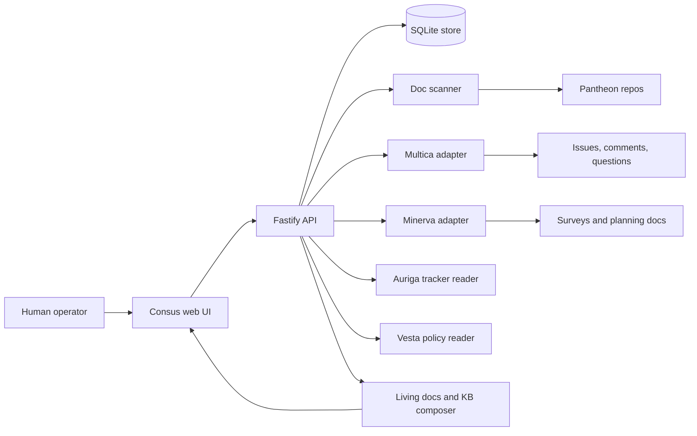
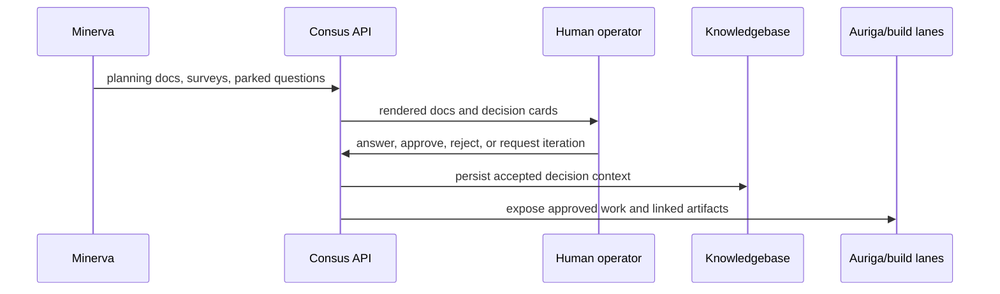

# Consus Architecture

Consus has three cooperating layers: adapters that read Pantheon state, a server
that normalizes that state into durable records, and a web surface that renders
the review and decision experience.

## Component Diagram

## Runtime Responsibilities

- `web/` renders decisions, epics, questions, docs, diagrams, and fire history.
- `server/routes/` exposes the HTTP surface for decisions, docs, questions,
  diagrams, workflows, epics, attachments, and KB entries.
- `server/adapters/` isolates Pantheon integrations so route code does not know
  every downstream API.
- `server/db/` owns migrations and SQLite access.
- `server/kb/` composes durable knowledgebase entries from approved context.
- `docs/` publishes the public OSS documentation and GitHub Pages site.

## Decision Flow

## Data Boundaries

Consus does not try to own every source of truth. Multica remains the issue and
comment system. Minerva remains the planning source. Consus stores the normalized
review state, local audit trail, rendered document index, attachment metadata,
diagram cache, and knowledgebase versions required for the human review loop.

## Deployment Shape

The application builds with Vite for the web UI and TypeScript for the server.
The public documentation site is intentionally static and lives under `docs/` so
GitHub Pages can publish it without booting the product server.
