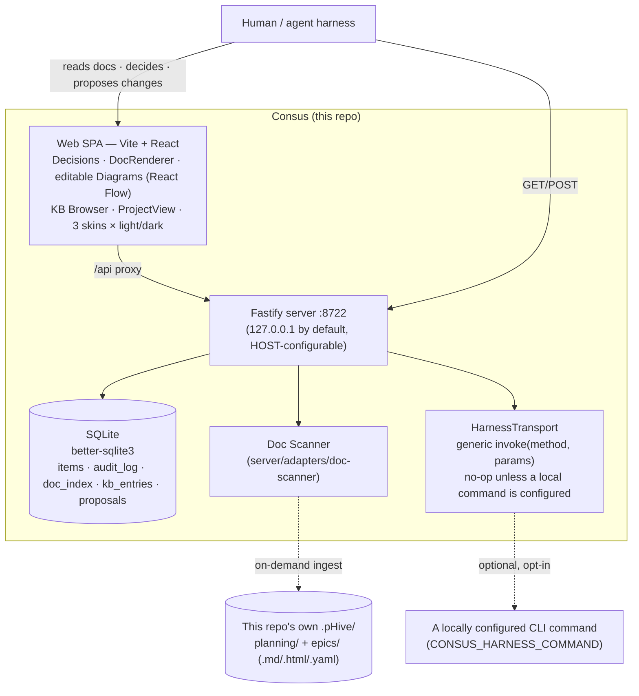

# Architecture

Consus is a **Fastify HTTP server** bound to `127.0.0.1:8722` by default, backed by a local **SQLite** file, serving both a JSON API and a built **Vite + React** SPA.



**Fastify · SQLite · Vite + React · zero external coupling**

---

## Components

### Fastify server (`server/index.ts`)

The HTTP backbone. Binds to `127.0.0.1:8722` by default — override with `HOST` and `PORT` env vars. In production, it also serves the built web SPA via `@fastify/static`.

- All routes are relative to `/api/` (except `/health`)
- File uploads via `@fastify/multipart`
- No auth layer — local-only by default; add your own in front if you expose via `HOST=0.0.0.0`

### SQLite store (`server/db/`)

A single local `.pHive/consus.sqlite` file, managed via `better-sqlite3`. The schema is idempotent: `migrate.ts` applies migrations in order and is safe to re-run.

**Tables:**

| Table | Purpose |
|-------|---------|
| `items` | All decisions, CBAs, and survey answers; the primary decision store |
| `audit_log` | Append-only history of every status change and verdict |
| `doc_index` | Indexed docs from scanned `.pHive/` trees |
| `kb_entries` | Knowledge base entries (approved decisions and docs) |
| `kb_versions` | Versioned history of each KB entry |
| `proposals` | Doc/diagram change proposals and their harness results |
| `events` | Pre-decision review queue: `doc_changed` and `decision_needed` triggers |

### Doc Scanner (`server/adapters/doc-scanner`)

The only adapter in the codebase. On demand — never in the background — it walks a repo's `.pHive/planning/` and `.pHive/epics/**`, indexes the markdown/HTML/YAML it finds into `doc_index`, and produces `doc_changed`/`decision_needed` events.

### HarnessTransport (`server/harness/transport.ts`)

The sole integration seam for "propose a change and let something apply it." A generic `invoke(method, params)` call to whatever local command is configured via `CONSUS_HARNESS_COMMAND`. It defaults to a no-op and has no knowledge of what's on the other end.

### Web SPA (`web/src/App.tsx`)

A Vite + React single-page application. Key components:

- **ProjectView** — per-project view showing diagrams, docs, and KB entries together
- **DecisionsView** — two-pane layout: queue list + detail panel
- **DocRenderer** — `marked`-based rendered markdown with in-place section editing
- **DiagramCanvas** — editable React Flow canvas for both diagram types
- **CommandPalette** — `⌘K` universal keyboard shortcut surface
- **SkinProvider** — four visual skins × light/dark/system theme

---

## Zero external coupling

Consus's server has zero live network coupling to any other system. It reads and writes only:

1. Local SQLite (`server/db/`)
2. Local filesystem (doc scanner, file attachments)
3. Whatever local command is configured in `CONSUS_HARNESS_COMMAND` (optional, opt-in)

`server/adapters/` contains only `doc-scanner/`. This is a fixed boundary — if Consus ever needs to talk to another system, that integration lives one layer up and reaches Consus over the same generic HTTP seams any other caller would use.

---

## Directory structure

```
server/
  index.ts            ← Fastify server entry
  db/
    migrate.ts        ← idempotent schema migration
    schema.ts         ← SQLite table definitions
  adapters/
    doc-scanner/      ← the only adapter; walks .pHive/
  harness/
    transport.ts      ← HarnessTransport — invoke(method, params)
  routes/             ← one file per route group
web/
  src/
    App.tsx           ← SPA entry
    components/       ← UI components
docs/                 ← this docs site
skills/
  consus/
    SKILL.md          ← agent harness contract
branding/             ← brand guide: colors, typography, logo
```
